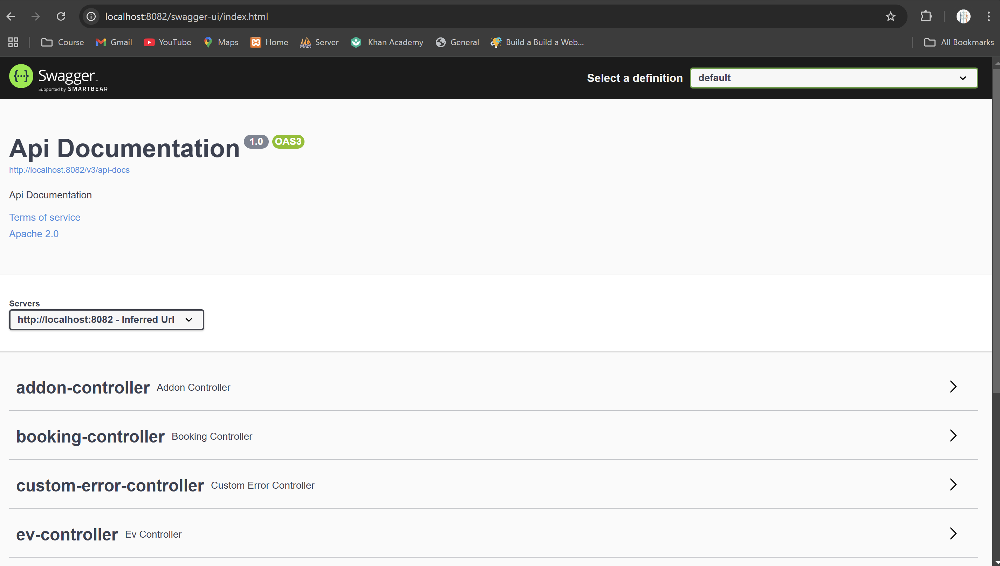
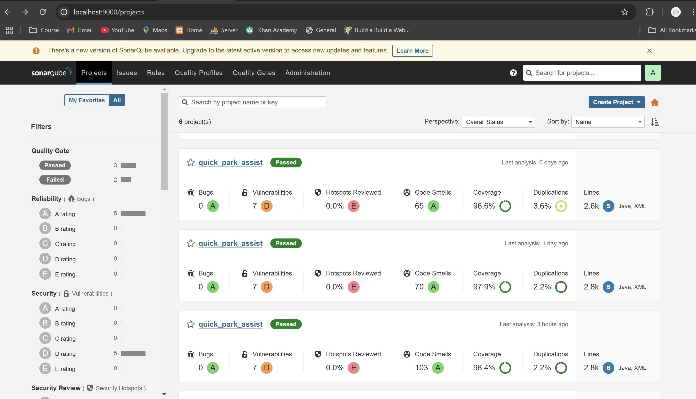
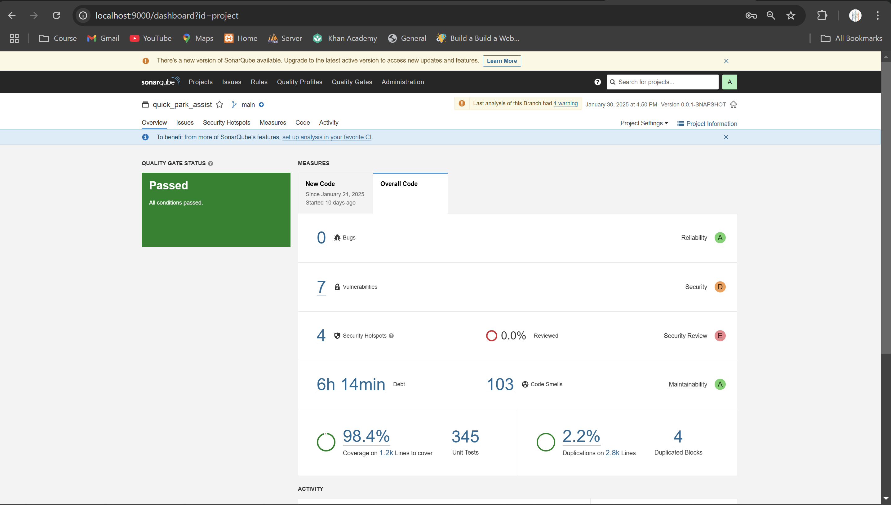
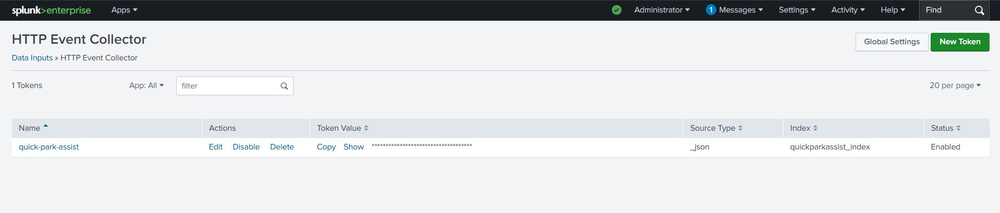
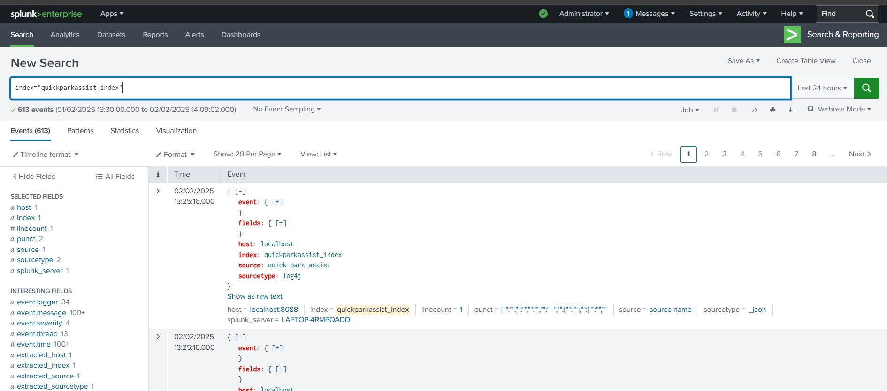

# Quick Park Assist Project Overview
## Modules Implemented

### 1. User Registration

Feature 1: Register New Users <br>
Users (drivers, vehicle owners, and parking spot owners) can register by providing personal details like name, email, phone number, and vehicle or parking spot details.

**Feature 2: Forgotten Password (SMTP Mail)** <br>
If users forget their password, they can reset it using the Forgotten Password feature. An email with a password reset link is sent via SMTP mail to their registered email address.

Feature 3: View Profiles <br>
Users can view their profile, which includes their personal information, vehicle details, and account settings.

Feature 4: Update Profiles <br>
Users can update their profile information, including contact details, email, phone number, and vehicle-related information.

Feature 5: Add Vehicles (EV or Normal) <br>
Users can add multiple vehicles, specifying whether they own an Electric Vehicle (EV) or a normal vehicle, allowing better service customization.

Feature 6: View Added Vehicles <br>
Users can view a list of their registered vehicles, including details like model, registration number, and type (EV or normal).

Feature 7: Deactivate Account <br>
Users can deactivate their account to temporarily disable it, which can be reactivated later.

Feature 8: Delete Account <br>
Users have the option to permanently delete their account and all associated data from the system.

---

### 2. Parking Spot Management

Feature 1: Add New Parking Spot <br>
Parking spot owners can add new spots by providing details such as location, availability, and pricing.

Feature 2: Search for Available Parking Spots <br>
Users can search for available parking spots in different locations based on their needs.

Feature 3: View Parking Spot Details <br>
Users can view information about each parking spot, including price, location, and availability.

Feature 4: Modify Parking Spot Details <br>
Parking spot owners can update details such as pricing, availability, and other attributes.

Feature 5: Remove Parking Spot <br>
Parking spot owners can remove unavailable or no longer needed parking spots from the system.

---

### 3. Parking Spot Booking

Feature 1: Book a Parking Spot <br>
Users can book an available parking spot by selecting the location and preferred time.

Feature 2: View Booking History <br>
Users can check their past and current bookings along with booking status.

Feature 3: Identify Booked Spot via Mobile Number <br>
Users can enter their mobile number to quickly find their reserved parking spot.

Feature 4: Modify Booking Details <br>
Users can edit their booking details, such as extending the parking duration or changing the date.

Feature 5: Cancel Booking <br>
Users can cancel their parking spot booking if plans change.

---

### 4. Addon Services

Feature 1: Add New Addon Services <br>
Users can add extra services like interior/exterior cleaning and polishing while booking a parking spot.

Feature 2: View Available Addon Services <br>
Users can browse a list of available addon services and their details.

Feature 3: Modify Addon Service Details <br>
Users can update addon service details, such as price or duration.

Feature 4: Delete Addon Service <br>
Users can remove addon services that are no longer required.

---

### 5. EV Charge Reservation

Feature 1: Reserve an EV Charging Spot <br>
Users can book an EV charging slot by selecting a charging station, date, and time.

Feature 2: View Reservation Details <br>
Users can view their reservation details, including time, station location, and vehicle info.

Feature 3: Modify EV Charge Reservation <br>
Users can change their reservation details, such as date and time, based on availability.

Feature 4: Delete EV Charge Reservation <br>
Users can cancel their EV charging reservation if they no longer need the service.

---

### API Documentation with Swagger
We have used **Swagger** for API documentation. Follow these steps to access it:

1. **Run the application**
2. Open your browser and go to:  
   👉 [`http://localhost:8000/swagger-ui/index.html`](http://localhost:8000/swagger-ui/index.html)

   ### Swagger UI Preview:


---

# SonarQube Integration Guide

### Steps to Integrate SonarQube with IntelliJ IDEA and Analyze a Project

---

#### **Step 1: Download SonarQube from the Official Website**

1. Visit the official SonarQube website: [https://www.sonarqube.org/downloads/](https://www.sonarqube.org/downloads/).
2. Scroll down to the **Community Edition (free)** section and click on the **Download** button.
3. The download should start automatically. You will get a `.zip` file for the SonarQube server.

---

#### **Step 2: Extract SonarQube**

1. Once the download is complete, extract the `.zip` file to a directory of your choice.  
   For example:
   - On Windows: `C:\SonarQube`
   - On Linux/macOS: `/opt/sonarqube`

---

#### **Step 3: Start the SonarQube Server**

** NOTE: Java Version: SonarQube requires Java 11 or higher. Set the JAVA_HOME environment variable to point to your JDK.**

1. Open a terminal (or Command Prompt) and navigate to the `bin` directory inside your SonarQube installation directory.
   - On Windows: Navigate to `C:\SonarQube\bin\windows-x86-64`.
   - On Linux/macOS: Navigate to `/opt/sonarqube/bin/linux-x86-64`.
2. Start the SonarQube server:
   - On Windows: Run `StartSonar.bat`.
   - On Linux/macOS: Run `./sonar.sh start`.
3. Wait for the server to start. You should see log messages indicating that SonarQube is running.

---

#### **Step 4: Access the SonarQube Web Interface**

1. Open a web browser and navigate to [http://localhost:9000](http://localhost:9000).
2. Log in using the default credentials:
   - Username: `admin`
   - Password: `admin`
3. Update the default password if prompted.

---

#### **Step 5: Install the SonarQube Plugin in IntelliJ IDEA**

1. Open IntelliJ IDEA.
2. Go to **File** > **Settings** (or **Preferences** on macOS).
3. In the left-hand panel, select **Plugins**.
4. Search for **SonarQube** in the search bar and press **Enter**.
5. Find the **SonarQube** plugin in the search results and click **Install**.
6. Restart IntelliJ IDEA after installation.

---

#### **Step 6: Create a Project on SonarQube Manually**

1. **Log in to the SonarQube Server**:
   - Open your browser and go to [http://localhost:9000](http://localhost:9000).
   - Log in using your credentials. Default credentials are:
      - Username: `admin`
      - Password: `admin` (if changed, use your updated password).
2. **Go to the Projects Section**:
   - From the SonarQube Dashboard, click on the **Projects** tab in the top menu bar.
   - Click the **Create Project** button (located at the top-right corner of the page).
3. **Select the Manual Setup Option**:
   - Choose **Manually** to create a project manually.
4. **Enter Project Details**:
   - Provide the following information:
      - **Project Name**: Enter a descriptive name for your project (e.g., "My Java Project").
      - **Project Key**: Enter a unique identifier for your project (e.g., `my_java_project`).
   - Click the **Set Up** button.
5. **Choose Analysis Method**:
   - When prompted, select **Locally**.
6. **Generate Authentication Token**:
   - Enter a name for the token (e.g., "MyProjectToken") and click **Generate Token**.
   - Copy the generated token immediately.
   - Click **Continue**.
7. **Select Build Tool and Generate Command**:
   - Select your preferred build tool (e.g., Maven, Gradle). Choose **Maven** for this setup.
   - SonarQube will display a command template. For Maven, it will look like this:
     ```bash
     mvn sonar:sonar \
       -Dsonar.projectKey=my_java_project \
       -Dsonar.host.url=http://localhost:9000 \
       -Dsonar.login=<your_generated_token>
     ```
   - Replace `<your_generated_token>` with the token generated earlier.
8. **Run the Command**:
   - Open a terminal (or Command Prompt) and navigate to the root directory of your project.
   - Paste and execute the generated command.
   - If the build is successful, the project will appear on the SonarQube dashboard.

---

#### **Step 7: Configure SonarQube Server in IntelliJ IDEA**

1. Open IntelliJ IDEA and navigate to your project.
2. Go to **File** > **Settings** (or **Preferences** on macOS).
3. In the left-hand menu, select **Tools** > **SonarQube**.
4. Click the **+** icon to add a new SonarQube server.
5. Fill in the following details:
   - **Name**: Enter a name for the server configuration (e.g., "My SonarQube Server").
   - **Server URL**: Enter the URL of your SonarQube server (e.g., `http://localhost:9000`).
   - **Authentication Token**: Paste the token generated in Step 6.
6. Click **Test Connection** to verify the setup.
7. Click **OK** to save.

---

#### **Step 8: View Results in SonarQube Dashboard**

1. Open your browser and navigate to [http://localhost:9000](http://localhost:9000).
2. Go to your project in the dashboard to view the analysis results, including issues, code smells, and quality gates.

---

By following these steps, you will successfully integrate SonarQube with IntelliJ IDEA and analyze your project for code quality.

### SonarQube Preview:




---
# Splunk Integration Guide

## OverviewSteps to Integrate Splunk with IntelliJ IDEA and Analyze Logs

---
#### **Step 1: Download Splunk from the Official Website**
1. Visit the official Splunk website: https://www.splunk.com/en_us/download.
2. Scroll down to the **Splunk Enterprise Free** section and click on the **Download Free** button.
3. Select the appropriate version for your operating system (Windows, macOS, or Linux).
4. The download should start automatically. You will get an installer file for Splunk.

---
#### **Step 2: Install Splunk**
1. Once the download is complete, run the installer file.
2. Follow the installation wizard to complete the installation.
   - **On Windows**: Accept the default settings or customize as needed.
   - **On Linux/macOS**: Follow the terminal prompts to complete the installation.
3. After installation, Splunk Enterprise will start automatically.

---
#### **Step 3: Start the Splunk Enterprise Server**
1. Open a terminal (or Command Prompt) and navigate to the Splunk Enterprise installation directory.
   - **On Windows**: Navigate to `C:\Program Files\Splunk\bin`.
   - **On Linux/macOS**: Navigate to `/opt/splunk/bin`.
2. Start the Splunk Enterprise server:
   - **On Windows**: Run `splunk start`.
   - **On Linux/macOS**: Run `./splunk start`.
3. Wait for the server to start. You should see log messages indicating that Splunk Enterprise is running.

---
#### **Step 4: Access the Splunk Enterprise Web Interface**
1. Open a web browser and navigate to http://localhost:8000.
2. Log in using the default credentials:
   - **Username**: `admin`
   - **Password**: `yourPassword`
---
#### **Step 5: Configure a Splunk Data Source for Logs**
1. Open **Splunk Web UI** (http://localhost:8000).
2. Click **Settings** > **Data Inputs**.
3. Click **New Index** (top-right corner).
4. Fill in the details:
   - **Index Name**: quickparkassist_index
   - **Max Size**: Default or as needed
5. Click **Save** to create the index.
---
#### **Step 6: Enable HTTP Event Collector (HEC)**
1. In **Splunk Web UI**, go to **Settings** > **Data Inputs**.
2. Click **HTTP Event Collector (HEC)**.
3. Click **Global Settings** and enable HEC.
4. Click **New Token**, enter:
   - **Name**: quick-park-assist
   - **Index**: Select quickparkassist_index
5. Copy the generated **HEC Token** (you'll need it in the Log4j2 config).
---
#### **Step 7: Configure Log4j2 to Send Logs to Splunk**
1. Add Log4j and Splunk Dependencies (Maven) in `pom.xml`
```bash
<dependencies>
   <dependency>
   <groupId>com.splunk.logging</groupId>
   <artifactId>splunk-library-javalogging</artifactId>
   <version>1.9.0</version>
   </dependency>
   <dependency>
       <groupId>com.squareup.okhttp3</groupId>
       <artifactId>okhttp</artifactId>
       <version>4.9.3</version> <!-- Required by Splunk library -->
   </dependency>
</dependencies>  
<repositories>
   <repository>
       <id>splunk-artifactory</id>
       <name>Splunk Releases</name>
       <url>https://splunk.jfrog.io/splunk/ext-releases-local</url>
   </repository>
</repositories>
```
2. Configure `log4j2.xml` for Splunk Logging
   - Create a `log4j2.xml` file inside `src/main/resources/` with the following content:
```bash
<?xml version="1.0" encoding="UTF-8"?>
<Configuration status="WARN" monitorInterval="30">
    <Appenders>
        <!-- Console Appender -->
        <Console name="Console" target="SYSTEM_OUT">
            <PatternLayout>
                <Pattern>%d{yyyy-MM-dd HH:mm:ss} %-5level [%t] %logger{36} - %msg%n%throwable</Pattern>
            </PatternLayout>
        </Console>

        <!-- Splunk HTTP Event Collector Appender -->
        <SplunkHttp
                name="quick-park-assist"
                url="http://localhost:8088"
                token=<!-- your token -->
                host="localhost"
                index="quickparkassist_index"
                type="raw"
                source="quick-park-assist"
                sourcetype="log4j"
                messageFormat="text"
                disableCertificateValidation="true">
            <PatternLayout pattern="%m" />
        </SplunkHttp>

        <!-- File Appender (Rolling) -->
        <RollingFile name="RollingFile"
                     fileName="logs/app.log"
                     filePattern="logs/app-%d{yyyy-MM-dd}.log.gz">
            <PatternLayout>
                <Pattern>%d{yyyy-MM-dd HH:mm:ss} %-5level [%t] %logger{36} - %msg%n</Pattern>
            </PatternLayout>
            <Policies>
                <TimeBasedTriggeringPolicy interval="1" modulate="true"/>
            </Policies>
            <DefaultRolloverStrategy max="7"/>
        </RollingFile>
    </Appenders>

    <Loggers>
        <!-- Application-Specific Logger -->
        <Logger name="com.quick_park_assist" level="debug" additivity="false">
            <AppenderRef ref="Console"/>
            <AppenderRef ref="quick-park-assist"/>
            <AppenderRef ref="RollingFile"/>
        </Logger>

        <!-- Root Logger (All Logs) -->
        <Root level="info">
            <AppenderRef ref="Console"/>
            <AppenderRef ref="quick-park-assist"/>
            <AppenderRef ref="RollingFile"/>
        </Root>
    </Loggers>
</Configuration>
```
3. Add
```bash
splunk.hec.uri=http://localhost:8088/services/collector/raw
#add your token here
splunk.hec.token=
splunk.hec.index=quickparkassist_index
splunk.hec.sourcetype=quick_park_assist
```
---
#### **Step 8: View Logs in Splunk Dashboard**
1. Open **Splunk Web UI** (http://localhost:8000).
2. Navigate to **Search & Reporting**.
3. Run the following query:
```bash
index="quickparkassist_index"
```

---
#### **Splunk Preview:**




---
# Quick Park Assist - Project Setup Guide

## Overview
This project is a **Spring Boot** web application using **Thymeleaf** and **Hibernate** for quick and efficient parking spot management.

## Technologies & Software Used

- **Java Development Kit (JDK)** 
- **Spring Boot** - Version 2.3.0 RELEASE
- **Thymeleaf** - Integrated templating engine
- **Hibernate Validator** - Version 6.2.0.Final
- **MySQL** - MySQL Connector Java 8.0.20
- **MySQL Workbench** - Version 8.0 CE
- **IntelliJ IDEA** - Version 2024.3
- **SonarQube** - Version 9.9.8.100196
- **Splunk** - Log analysis and monitoring tool (Version 1.8.0)
- **Spring Security** - Authentication and Authorization
- **Lombok** - Version 1.18.30
- **Swagger (Springfox Boot Starter)** - Version 3.0.0
- **JUnit & Mockito** - Testing frameworks
- **H2 Database** - Testing environment
- **Maven** - Project build management

## Installation & Setup Guide

### Step 1: Install Required Software
Ensure you have the following software installed on your system:
1. **JDK 21** - [Download JDK](https://www.oracle.com/java/technologies/javase-downloads.html)
2. **MySQL & MySQL Workbench 8.0 CE** - [Download MySQL](https://dev.mysql.com/downloads/)
3. **IntelliJ IDEA 2024.3** - [Download IntelliJ](https://www.jetbrains.com/idea/download/)
4. **SonarQube 9.9.8.100196** - [Download SonarQube](https://www.sonarqube.org/downloads/)
5. **Splunk** - [Download Splunk](https://www.splunk.com/en_us/download.html)

### Step 2: Clone the Repository
```bash
git clone https://github.com/SandeshPatil2003/quick_park_assist.git
```

# Project Setup & Configuration
```bash

### 1️⃣ Database Configuration

spring.datasource.url=jdbc:mysql://localhost:3306/quick_park_assist  # Replace with your database name
spring.datasource.username=root  # Replace with your MySQL username
spring.datasource.password=password  # Replace with your MySQL password
spring.datasource.driver-class-name=com.mysql.cj.jdbc.Driver
spring.jpa.hibernate.ddl-auto=update
spring.jpa.properties.hibernate.dialect=org.hibernate.dialect.MySQL5InnoDBDialect

✅ Ensure MySQL is installed and running. If your database runs on a different port (default 3306), update the URL accordingly.

---

### 2️⃣ Server Configuration
Change the server port in case of conflicts:
server.port=8082  # Modify if required
By default, the application runs on 8082 for this project. Change it if needed.

---

### 3️⃣Email Configuration
spring.mail.host=smtp.gmail.com
spring.mail.port=587
spring.mail.username=your-email@gmail.com  # Replace with your email
spring.mail.password=your-app-password  # Replace with your app password
spring.mail.properties.mail.smtp.auth=true
spring.mail.properties.mail.smtp.starttls.enable=true
spring.mail.protocol=smtp

📌 Important:

Replace your-email@gmail.com with your Gmail ID.
Generate an App Password instead of using your actual email password.

**How to Generate an App Password for Gmail:** <br>

1. Go to Google Account Settings:
Open https://myaccount.google.com/.

2. Enable Two-Factor Authentication (2FA):
Enable 2FA in the Security section if not already done.

3. Generate an App Password:

 In the Security section, under "Signing in to Google," find App Passwords.
Select Mail for the app and Windows Computer (or your preferred device) for the device.
Click Generate to get a 16-character App Password.

4. Use the App Password:
Copy the generated App Password and use it in your application.properties file under spring.mail.password.

**If you face any issues, verify that your database and email credentials are correctly set up.**

4️⃣ Database Structure
The project includes a folder named script, which contains the quick_park_assist.sql file with the database structure.

To set up the database:

Locate the quick_park_assist.sql file inside the script folder.
Run the script in your MySQL database to create the required tables and structure:

mysql -u root -p < script/quick_park_assist.sql

This will set up the database structure for the project. Make sure to update the database credentials in the application.properties file accordingly.
